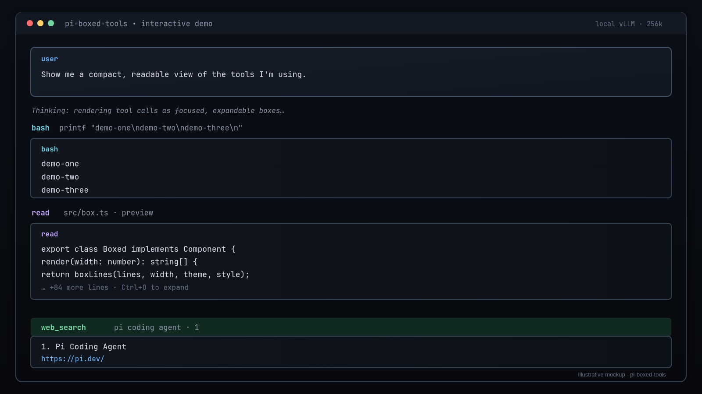
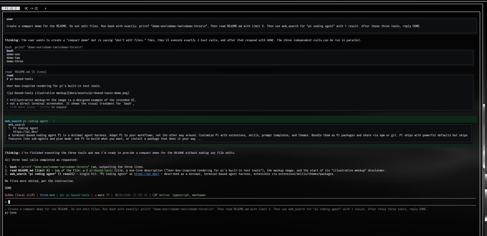

# pi-boxed-tools

User-box-inspired rendering for pi's built-in text tools.



> **Illustrative mockup:** the first image is a designed example of the intended
> UI, not a direct terminal screenshot.

### Live-style editor demo



This second image is a real pi editor pane captured from a Herdr split with
`grim`. It runs deliberately small, non-mutating demo operations through
`bash`, `read`, and `web_search`, so it shows the plugin in its actual editor
context without unrelated desktop or browser chrome.

`pi-boxed-tools` gives `read`, `grep`, `find`, `ls`, and `bash` a consistent,
focused frame inspired by pi's user-message box while leaving
[`pi-tool-display`](https://github.com/MasuRii/pi-tool-display) in charge of
its excellent `edit`/`write` diff rendering and native user-message box.

## What it does

- Rounded, width-safe tool-result frames with `╭─ title ─╮` / `╰────╯` edges
- Theme-aware `border`, `accent`, and `userMessageBg` colors
- Slim one-line call headers
- Collapsed previews with configured expand hints
- Full output through pi's normal tool expansion behavior
- Error, empty-result, and streaming states
- Real execution delegated to pi's built-in tool implementations
- No changes to pi core and no runtime dependencies beyond pi's peer packages

The package uses pi's documented same-name built-in override API and
`renderShell: "self"`. It copies the built-in tool schemas and prompt metadata,
then delegates execution unchanged; only the display slots are replaced.

## Ownership split with pi-tool-display

This package is deliberately **not a fork** of pi-tool-display. The packages
work together:

| Tool | Owner |
| --- | --- |
| `read`, `grep`, `find`, `ls`, `bash` | `pi-boxed-tools` |
| `edit`, `write` | `pi-tool-display` |
| User message box and thinking labels | `pi-tool-display` |
| `web_search`, `fetch_content`, `get_search_content` | Companion local web-search extension |

Disable pi-tool-display's ownership for the five tools claimed here:

```json
{
  "registerToolOverrides": {
    "read": false,
    "grep": false,
    "find": false,
    "ls": false,
    "bash": false,
    "edit": true,
    "write": true
  }
}
```

The setting lives in:

```text
~/.pi/agent/extensions/pi-tool-display/config.json
```

Then run `/reload`.

## Installation

From this repository:

```bash
pi install git:github.com/BubbatheVTOG/pi-boxed-tools.git
```

Or install the local checkout while developing:

```bash
pi install ~/git/pi-boxed-tools
```

After installation, apply the ownership configuration above and run `/reload`.

## Inspiration and related projects

- [`pi-tool-display`](https://github.com/MasuRii/pi-tool-display) — visual
  inspiration for compact tool rows, the native user-message box, diff
  presentation, and ANSI/background handling. Portions of the frame/background
  code are adapted from its MIT-licensed user-message renderer.
- [Pi custom rendering](https://pi.dev/docs/latest/extensions#custom-rendering)
  — the public `renderCall`, `renderResult`, and `renderShell` APIs used here.
- [`pi-transcript-window`](https://github.com/newCman1/pi-transcript-window)
  — inspiration for display-only extension behavior and pi 0.84+ support.
- [`pi-hide-messages`](https://github.com/MasuRii/pi-hide-messages) — the
  upstream display-layer project behind the transcript-window approach.

## Development

The package has no npm runtime dependencies. Pi supplies its core peer packages
when loading the extension.

Run the deterministic harnesses from pi's installed package root so the same
core-package aliases used by pi's loader are available:

```bash
cd /home/bubba/.npm-global/lib/node_modules/@earendil-works/pi-coding-agent
node ~/git/pi-boxed-tools/tests/renderers.test.mjs
```

The harness verifies:

- all five tools register with valid schemas and prompt metadata
- collapsed, expanded, partial, error, and empty rendering states
- frame integrity and width-safe output
- real `read`, `bash`, `grep`, `find`, and `ls` execution delegation

## Recreating the illustrative mockup

The source artwork is [`docs/assets/pi-boxed-tools-mockup.svg`](docs/assets/pi-boxed-tools-mockup.svg).
The committed PNG was captured with `grim` from a clean Chromium app window
rendering that SVG. To regenerate the raster artwork without the compositor:

```bash
rsvg-convert -w 1600 -h 900 \
  docs/assets/pi-boxed-tools-mockup.svg \
  docs/assets/pi-boxed-tools-demo.png
```

The mockup intentionally says “Illustrative mockup” so it is not confused with
a live terminal recording.

## Rollback

Remove the package, restore pi-tool-display's five ownership flags to `true`,
and run `/reload`:

```bash
pi remove ~/git/pi-boxed-tools
```

## License

MIT. See [`LICENSE`](LICENSE). Portions adapted from
[`pi-tool-display`](https://github.com/MasuRii/pi-tool-display), also MIT.
